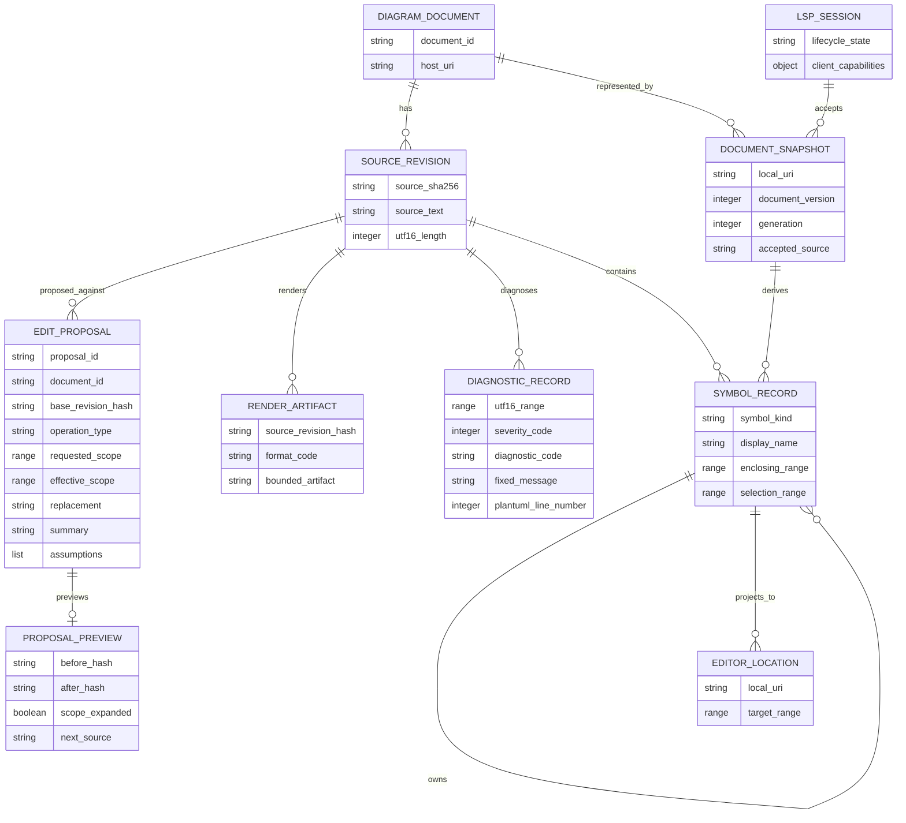
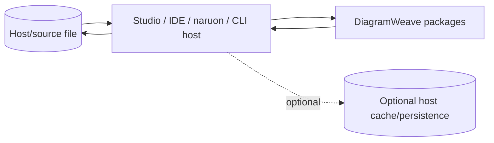

# DiagramWeave Conceptual Domain and ERD

**Status:** Accepted conceptual model. Protected main has no DiagramWeave-owned database.
**Last reviewed:** 2026-08-09

This document models durable product concepts without inventing persistence. Current packages keep source/session data in process or caller-owned files. A future Studio/service persistence layer requires its own physical ERD, migration, tenant, lifecycle, backup, and authorization evidence.

## Current conceptual model

These are documentation concepts. Runtime implementations may use immutable JavaScript objects rather than these exact class names.

## Host ownership

DiagramWeave foundation packages do not own:

- user/account/tenant tables;
- file history or cloud document storage;
- credential/keychain persistence;
- telemetry database;
- provider conversation/history store;
- renderer artifact store;
- distributed collaboration state.

A future host can own those, but must use public package contracts rather than treating private package state as stable persistence IDs.

## Identity domains

- `document_id`: caller/host product identity; not authorization by itself.
- `source_sha256`: immutable source revision identity; not a tenant/user key.
- `proposal_id`: proposal identity; must bind to `document_id` and `base_revision_hash`.
- URI: LSP/source locator owned and validated by the host/session boundary.
- document version/generation: stale-state concurrency metadata, not durable global chronology.

These identities must not be conflated.

## Future Studio persistence — conceptual only

If Studio adds cloud/local project persistence, likely conceptual entities include `workspace_record`, `diagram_document`, `source_revision`, `proposal_record`, `render_artifact`, `user_preference`, `provider_configuration`, and `audit_event`. They are not current database objects.

A future physical ERD must explicitly model tenant/workspace ownership, encrypted credential handles rather than secrets, revision ancestry, retention/export, collaboration/concurrency, artifact provenance, and audit/system time.

## Persistence acceptance rule

Before any conceptual entity becomes a DiagramWeave-owned persisted object, the implementing change must add an Accepted ADR, physical ERD/migrations/rollback, authorization/tenant model, concurrency/idempotency behavior, backup/recovery, privacy/retention/export controls, and integration tests. This document then updates the affected entity from conceptual to as-built.
