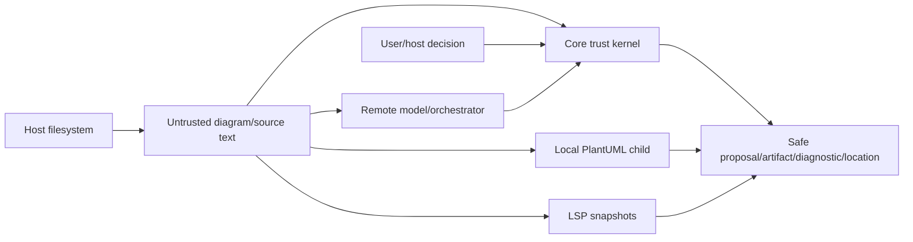

# DiagramWeave Threat Model

**Status:** Accepted baseline for protected-main foundation.
**Last reviewed:** 2026-08-09

## Scope

This threat model covers source/proposal validation, the Contextual Orchestrator adapter, local PlantUML renderer, CLI filesystem boundary, Language Server and stdio framing, and repository autonomous-development/release authority. Future Studio persistence/collaboration is outside current implementation and requires a new threat-model extension.

## Trust boundaries

## Threat inventory

| Threat | Impact | Controls |
|---|---|---|
| stale model proposal | overwrites newer source | exact SHA-256 base revision; fail closed |
| hidden scope expansion | edits unintended source | requested/effective scopes + explicit reason/approval |
| prompt injection/source-as-instruction | model steers tools/policy | source is untrusted data; adapter returns proposal only; Core validates |
| provider endpoint/credential misuse | SSRF/secret disclosure | HTTPS/loopback-only HTTP, explicit token, bounded request, no ambient env reads |
| PlantUML include/file/network access | local/remote data disclosure | SANDBOX, stdin-only, empty child env, no include policy in foundation |
| renderer output/stderr disclosure | source/path leakage | bounded parse + fixed sanitized diagnostics, raw child data retained inside boundary |
| shell/argument injection | code execution | spawn without shell, absolute host-supplied paths, fixed flags |
| symlink/path traversal/output collision | arbitrary file overwrite | CLI path/symlink checks, deterministic discovery, exclusive/atomic publication |
| malformed/oversized JSON-RPC | memory/queue DoS | strict Content-Length/UTF-8/JSON-RPC, bounded messages and queues |
| stale LSP completion | superseded state restored | version/generation checks and accepted-snapshot replacement |
| parser ambiguity | incorrect editor semantic claim | conservative explicit syntax; fail by omission; one authoritative symbol tree |
| Markdown hover injection | UI content escape | dynamic/fixed safe formatting and source-bounded evidence |
| URI/source reflection | information disclosure | fixed protocol errors and sanitized diagnostic contracts |
| autonomous model self-merge/release | governance bypass | model/verification/publication/review/release authority separation |
| mutable CI dependency/action | supply-chain compromise | immutable action refs and pinned package/toolchain evidence |

## STRIDE interpretation

### Spoofing

Document IDs, URIs, proposal IDs, source hashes, and LSP versions are data identifiers, not authenticated user identities. Authentication/tenant identity is host-owned. Model/provider identity is supplied through the adapter configuration and cannot be inferred from assistant content.

### Tampering

Source changes occur only through host-visible edits or explicit Core application against the exact revision. Renderer artifacts are tied to source revision. LSP editor intelligence reads accepted snapshots and cannot mutate files.

### Repudiation

The foundation itself has no durable audit store. Hosts should record user acceptance/save/commit and provider usage according to their own privacy policy. GitHub PR/check/review history is the development evidence store.

### Information disclosure

The renderer and stdio boundaries minimize source/path/child-output reflection. The Orchestrator adapter does not log source/prompts/tokens. Host UIs must not treat diagnostics as permission to disclose complete private diagrams.

### Denial of service

Bound source, request, renderer stdout/stderr/deadline, JSON-RPC message/queue, symbol count, folding count, completion output, and other collection sizes. Deep/hostile structures use bounded iterative logic where applicable.

### Elevation of privilege

Source/model content cannot change Core policy, renderer sandbox mode, filesystem authority, or repository merge/release credentials. Studio/user approval remains a separate authority.

## Required adversarial tests

- stale revision and scope expansion rejection;
- invalid/hostile proposal shapes and assistant JSON;
- endpoint scheme/host validation and timeout/provider failures;
- renderer source/output/stderr/deadline limits and sandbox flags;
- symlinks/path traversal/output collisions/atomic replacement;
- malformed/duplicate/non-ASCII/oversized Content-Length and JSON-RPC;
- hostile capability getters/proxies and invalid UTF-16 positions;
- comments/strings/includes/macros/ambiguous declarations omitted from editor intelligence;
- stale async open/change/close races;
- hover/definition/reference source/URI injection boundaries;
- CI credential/action pinning and model-publication authority separation.

## Residual risk

PlantUML itself and Java are host-selected executable dependencies; DiagramWeave reduces their capabilities but cannot prove the absence of every upstream vulnerability. Hosts/distributors own artifact provenance, compatible licensing, patch cadence, and operating-system sandboxing beyond the process contract.

## Review triggers

Revisit when adding Studio persistence/collaboration, include-capable rendering, arbitrary filesystem/workspace indexing, new model providers or tools, plugin execution, browser/WebView rendering, new protocol transports, or changed autonomous/release credentials.
