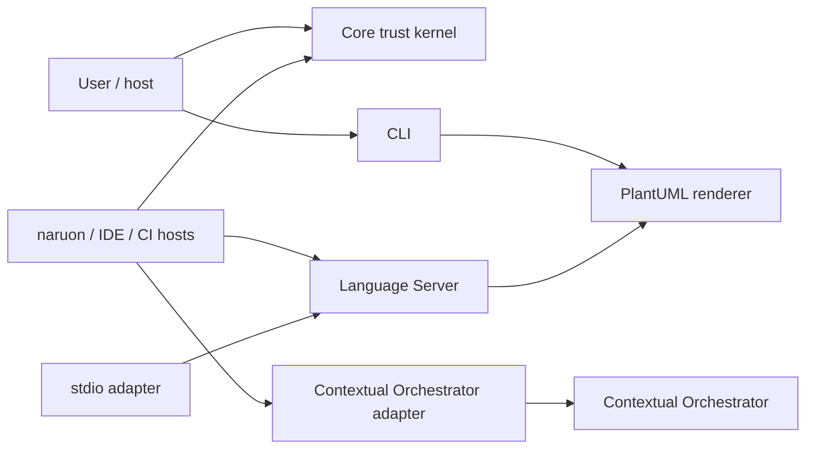
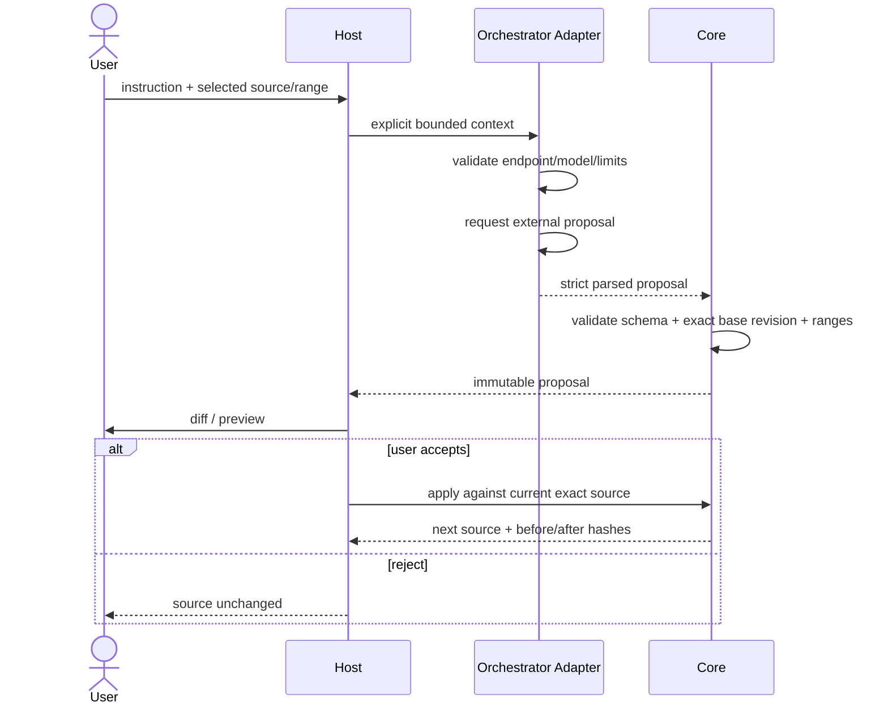
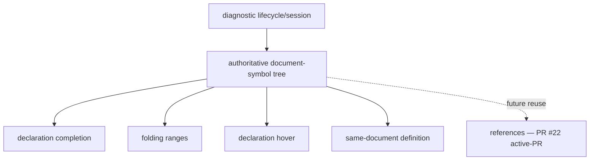
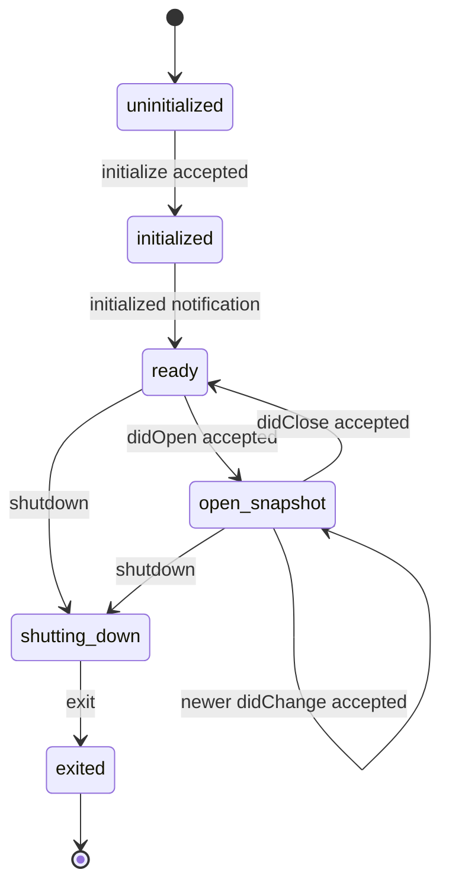
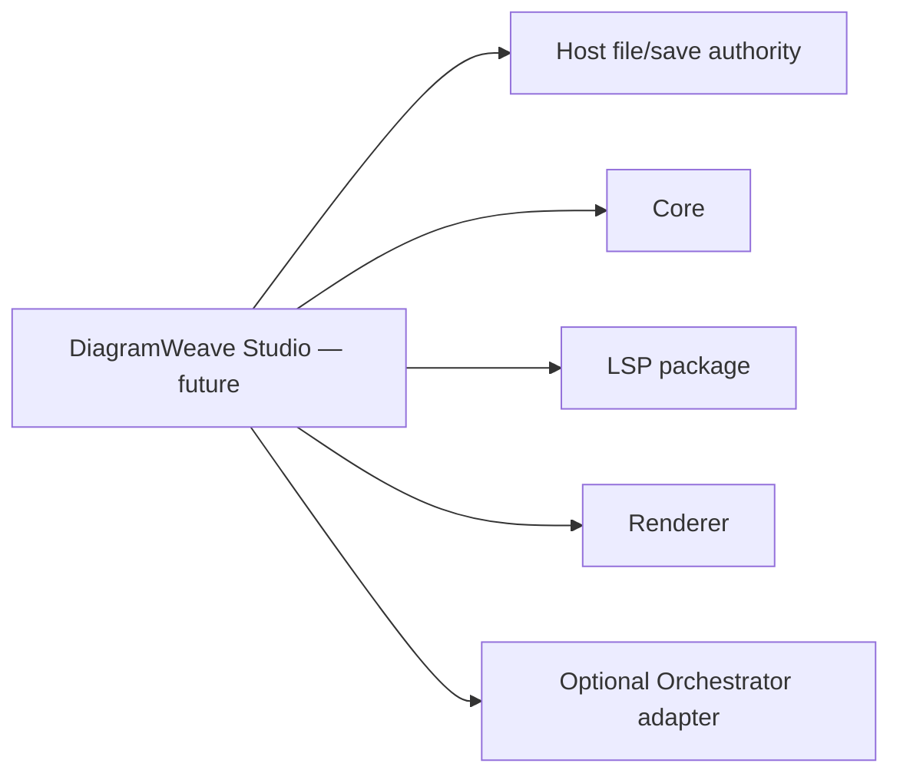
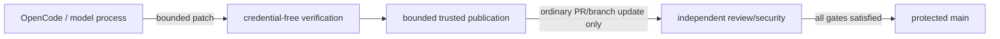

# DiagramWeave UML and Runtime Views

**Status:** Accepted diagrams for protected-main foundations and explicitly labelled future/active-PR boundaries.  
**Last reviewed:** 2026-08-09

## Component view



## Proposal lifecycle sequence



## Renderer sequence

```mermaid
sequenceDiagram
    actor Host
    participant Renderer
    participant PlantUML as local PlantUML child
    participant Diagnostic as diagnostic sanitizer

    Host->>Renderer: source + format + absolute Java/JAR paths
    Renderer->>Renderer: enforce source/timeout/output limits
    Renderer->>PlantUML: stdin only; SANDBOX; empty environment
    PlantUML-->>Renderer: stdout + bounded standard report
    alt valid artifact
        Renderer->>Renderer: validate SVG/PNG structure
        Renderer-->>Host: immutable artifact + source hash
    else syntax/report failure
        Renderer->>Diagnostic: parse bounded report
        Diagnostic-->>Renderer: fixed-message frozen diagnostic
        Renderer-->>Host: safe error/diagnostic
    end
```

## Language Server layer view



Every feature reuses accepted source snapshots and the same structural evidence. No outer feature gets authority to parse includes/macros/remotely rendered semantics independently.

## Accepted-document state machine



A stale asynchronous completion may not transition a later snapshot back to an older generation/version.

## Studio boundary — future host



Studio owns visible editor state, focus, accessibility, user approval, file save/recovery, and optional account/persistence behavior. Foundation packages do not silently acquire those responsibilities.

## Autonomous-development authority flow



PR #24 changes the repository's hourly governance workflow and remains active-PR until merged.

## Diagram maintenance rule

Update this file when package ownership, public lifecycle, trust/authority boundary, protocol surface, or deployment topology changes. Active-PR and future-host items must not be relabelled as as-built until protected-main integration is proven.