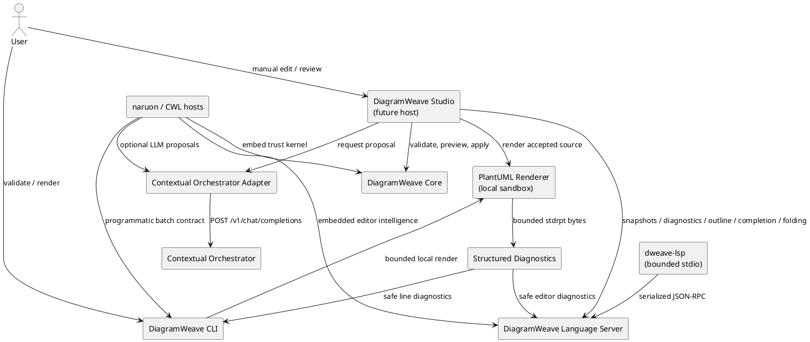

# DiagramWeave Architecture

## Purpose

DiagramWeave is a source-first editor platform for PlantUML and future text diagram languages. The architecture protects manual editing as the authoritative workflow while making LLM output reviewable, revision-bound, and replaceable. The implemented foundation contains a portable trust kernel, a Contextual Orchestrator adapter, an isolated local PlantUML renderer, safe structured diagnostics, a deterministic CLI, a transport-neutral Language Server, bounded JSON-RPC stdio integration, capability-negotiated hierarchical or legacy-flat document symbols, deterministic declaration completion, and conservative folding ranges. It still contains no database, desktop shell, or hidden document store; future surfaces must reuse these boundaries rather than reimplement them.

## Architectural principles

1. **Source files are authoritative.** A host may cache editor state, but saved text remains the system of record.
2. **Manual editing is independent.** DiagramWeave remains useful without an account, network connection, model provider, or Contextual Orchestrator instance.
3. **AI proposes; the host decides.** Model output is an untrusted `EditProposal`, not a direct mutation.
4. **Exact revisions fail closed.** A proposal applies only to the SHA-256 revision from which it was produced.
5. **Scope expansion is visible.** An effective range outside the requested range requires a reason and explicit host approval.
6. **Modules compose without becoming inseparable.** Each package has one purpose and can run inside DiagramWeave Studio, naruon, an IDE extension, a CLI, or another CWL service.
7. **Provider and renderer boundaries are adapters.** Core never imports a network client, renderer process, UI framework, or persistence implementation.
8. **Diagnostics are safe data contracts.** Raw child output stays inside the renderer boundary; reusable hosts receive only bounded, fixed-message, deeply frozen records.
9. **Editor intelligence fails by omission.** Document symbols, declaration completion, and folding ranges recognize only explicit high-signal syntax and do not invent semantics from relations, includes, macros, malformed source, or remote content.
10. **Hierarchy requires complete structural evidence.** Only stack-ordered package or namespace declaration braces with identical opening and closing indentation create children; ambiguous or incomplete source remains flat.
11. **Protocol compatibility is presentation, not parsing.** `symbolInformationForDocument` iteratively derives immutable `SymbolInformation[]` from the same authoritative tree when a client does not advertise hierarchical support.
12. **Composed layers retain independent evidence.** Diagnostics, document symbols, compatibility adaptation, completion, and folding own separate state and tests so an outer feature cannot hide regressions in an inner layer.

## System context



The diagram is documentation, not a runtime dependency. DiagramWeave Core can be used without Studio, Contextual Orchestrator, PlantUML, or the Language Server. The Language Server can be embedded without the stdio package.

## Module boundaries

### DiagramWeave Core

Package: `@contextualwisdomlab/diagramweave-core`

Responsibilities:

- calculate deterministic SHA-256 source revisions;
- validate the `EditProposal` contract;
- reject stale revisions;
- validate requested and effective UTF-16 ranges;
- detect scope expansion;
- require explicit approval before previewing or applying expanded edits;
- return immutable normalized values.

Non-responsibilities:

- rendering PlantUML;
- calling an LLM;
- reading or writing files;
- saving history;
- choosing whether a user should accept a proposal;
- parsing a diagram into a full semantic AST.

Public entry points:

```js
import {
  applyEditProposal,
  hashSource,
  previewEditProposal,
  validateEditProposal,
} from '@contextualwisdomlab/diagramweave-core';
```

### Contextual Orchestrator adapter

Package: `@contextualwisdomlab/diagramweave-contextual-orchestrator`

Responsibilities:

- validate the configured endpoint, model, token, timeout, and fetch boundary;
- allow remote HTTPS and loopback-only HTTP;
- bound source and instruction sizes;
- construct the exact two-message model contract;
- send a non-streaming OpenAI-compatible request;
- reject error bodies without reading them;
- distinguish timeout, transport, HTTP, response-shape, and assistant-JSON failures;
- pass parsed output through DiagramWeave Core validation.

Non-responsibilities:

- persisting credentials;
- reading process environment variables;
- logging source, prompts, responses, or tokens;
- applying a proposal;
- rendering or saving the accepted source.

### DiagramWeave Studio

Status: future product surface.

Studio will own file tabs, manual source editing, preview layout, diagnostics, outline, completion and folding presentation, Context Inspector, diff review, keyboard interaction, recovery, and user approval. It must consume Core rather than reimplement revision or scope checks, consume the shared renderer diagnostic record rather than parse stderr, and apply Language Server text edits rather than reconstruct completion ranges. UI work requires Figma/Product Design state coverage before implementation because source, preview, completion, outline, diff, diagnostics, offline, timeout, conflict, and scope-expansion states interact visibly.

### PlantUML renderer

Package: `@contextualwisdomlab/diagramweave-plantuml-renderer`

Responsibilities:

- require absolute host-supplied Java and PlantUML JAR paths;
- pass source only through stdin with no temporary source file;
- spawn without a shell and with an empty child environment;
- force PlantUML `SANDBOX`, UTF-8, source-metadata suppression, standard reporting, and SVG/PNG pipe mode;
- bound source, stdout, stderr, and wall-clock time;
- validate one complete SVG or PNG stream;
- parse bounded `-stdrpt:1` bytes into safe LSP-compatible line diagnostics;
- sanitize, clone, bound, and deeply freeze diagnostics crossing a host boundary;
- return an immutable base64 artifact tied to the Core SHA-256 source revision;
- return stable source-free errors.

Non-responsibilities:

- bundling or downloading Java, PlantUML, Graphviz, or fonts;
- enabling local or remote includes;
- persisting source or artifacts;
- implementing a full PlantUML parser or character-accurate diagnostics;
- providing a CLI, Language Server lifecycle, or Studio preview state.

Public entry points:

```js
import {
  createPlantUmlRenderer,
  parsePlantUmlStandardReport,
  sanitizePlantUmlDiagnostics,
} from '@contextualwisdomlab/diagramweave-plantuml-renderer';
```

The public diagnostic uses the Language Server Protocol range shape, error severity `1`, code `plantuml.syntax`, a fixed product message, and a one-based `data.plantUmlLineNumber`. Raw stderr, raw labels, source excerpts, paths, and credentials never cross the renderer boundary.

The renderer is independently reusable by Studio, CLI, naruon, the Language Server, or another CWL host. A future include-capable renderer must be a separate explicit policy mode; it must not weaken this package's `SANDBOX` contract.

### DiagramWeave CLI

Package: `@contextualwisdomlab/diagramweave-cli`

Responsibilities:

- provide `dweave validate` and `dweave render` for one file or a deterministic recursive batch;
- reuse the sandboxed PlantUML renderer without an LLM or network dependency;
- reject symbolic links, unsafe paths, predictable output collisions, and implicit overwrite;
- revalidate and clone renderer diagnostics before including them in reports;
- return stable human and JSON reports with line-addressable diagnostics and exit codes `0`, `1`, and `2`;
- expose a process-independent API reusable by naruon, CI, and another CWL host.

Non-responsibilities:

- bundling or discovering Java and PlantUML;
- parsing raw PlantUML stderr or recomputing source locations;
- concurrent folder rendering, formatting, policy packs, Studio state, or persistence;
- exposing source, raw renderer diagnostics, raw labels, executable paths, or environment values.

### DiagramWeave Language Server

Package: `@contextualwisdomlab/diagramweave-language-server`

Responsibilities:

- implement initialize, initialized, shutdown, and exit lifecycle rules;
- own bounded full-document synchronization for local `.puml` and `.plantuml` identifiers;
- publish safe diagnostics from the shared renderer boundary;
- provide conservative source-order `textDocument/documentSymbol` results, returning `DocumentSymbol[]` only to clients that explicitly advertise `hierarchicalDocumentSymbolSupport: true` and otherwise returning legacy-compatible `SymbolInformation[]`;
- advertise and serve deterministic `textDocument/completion` only to clients that declare completion support;
- advertise and serve conservative `textDocument/foldingRange` only to clients that declare a valid folding capability;
- preserve UTF-16 positions across multilingual source and emoji;
- normalize caller-owned records into frozen snapshots;
- prevent stale concurrent open, change, and close completions from restoring old state;
- expose one transport-neutral API for Studio, IDE adapters, naruon, and service wrappers.

The implementation is layered:

```text
diagnostic session
  -> document-symbol session
    -> declaration-completion session
      -> folding-range session
```

Each wrapper delegates lifecycle and inner features while owning only the source required by its feature. Direct unit tests cover every layer independently, even though the public entry point exposes the outer folding session.

Document-symbol hierarchy is computed locally after explicit declaration parsing. One unmatched unquoted package or namespace declaration brace may become a parent only when it is closed in stack order by a standalone brace with identical indentation. Quoted, commented, balanced one-line, unmatched, multi-open, cross-indented, and crossed structure remains flat. Parent ranges extend through proven close lines, roots and siblings preserve source order, and the frozen tree is constructed bottom-up without recursive product traversal.

Initialize-time capability negotiation changes only presentation. Exact boolean `hierarchicalDocumentSymbolSupport: true` returns the authoritative `DocumentSymbol[]` tree. Every other and hostile capability state invokes `symbolInformationForDocument`, which walks the same authoritative tree iteratively and returns deeply frozen source-preorder `SymbolInformation[]` with the validated local URI, enclosing range, and immediate proven `containerName`. Both response shapes come from the same authoritative symbol tree; no second PlantUML scanner is introduced.

Declaration completion uses a fixed catalog, LSP keyword CompletionItems, plain-text insertion, stable order, and explicit text edits. It returns no result in comments, quoted labels, relations, directives, completed declarations, or the middle of an existing identifier. It does not call an LLM, renderer, filesystem, workspace index, include processor, macro processor, or network service.

`createFoldingLanguageServerSession` wraps the completion session and stores only successful accepted source snapshots. `foldingRangesForSource` walks the same authoritative symbol tree iteratively, emitting immutable zero-based line ranges only for complete nonempty package and namespace scopes. Initialize-time `rangeLimit` and `lineFoldingOnly` values are validated under hostile boundaries; unsupported or malformed capabilities do not advertise `foldingRangeProvider`. Folding performs no renderer, LLM, filesystem, include, macro, workspace, or network work.

Non-responsibilities:

- opening, saving, or watching source files;
- parsing the complete PlantUML grammar;
- evaluating includes, macros, relations, or renderer output for editor intelligence;
- implementing completion resolve, snippets, semantic member completion, hover, definition, references, rename, or arbitrary region folding;
- owning UI focus, selection, acceptance, or accessibility state;
- persisting source or telemetry.

### Bounded stdio Language Server

Package: `@contextualwisdomlab/diagramweave-language-server-stdio`

Responsibilities:

- parse bounded ASCII Content-Length headers and strict UTF-8 JSON-RPC 2.0;
- reject malformed, oversized, duplicated, unsupported, or non-ASCII framing;
- serialize incoming chunks and protocol dispatch;
- translate stable Language Server failures to fixed JSON-RPC error codes;
- map invalid completion positions to `-32602` Invalid params;
- frame bounded response and notification messages;
- provide the `dweave-lsp` process boundary and graceful shutdown/exit semantics.

Non-responsibilities:

- duplicating diagnostics, document symbols, completion, folding, or source snapshots;
- reading source URIs;
- applying returned completion edits;
- exposing source, paths, child stderr, or host exception values.

## Data flow

### Proposal request

1. The host obtains an explicit source string, document identifier, requested range, operation type, and instruction.
2. The adapter validates sizes and range boundaries.
3. The adapter hashes the exact source and serializes the request as untrusted JSON data.
4. Contextual Orchestrator routes or conducts the model work behind its OpenAI-compatible interface.
5. The adapter accepts only one raw JSON object or one complete JSON code fence.
6. Core validates schema, identifiers, operation type, ranges, replacement, summary, assumptions, and source revision.
7. The host receives an immutable proposal. The source remains unchanged.

### Proposal preview and application

1. The host calls `previewEditProposal(source, proposal)`.
2. Core recomputes the current revision and rejects stale proposals.
3. Core rejects an expanded range unless `allowScopeExpansion: true` is explicit.
4. Core returns next source and before/after hashes without mutating input.
5. The host displays source diff and, later, before/after rendered artifacts.
6. Only a user-approved host action calls `applyEditProposal` or writes a file.

### Render failure and diagnostic propagation

1. The renderer sends the accepted source only through PlantUML stdin.
2. stdout and stderr are captured under independent byte limits and a wall-clock deadline.
3. `parsePlantUmlStandardReport` decodes bounded stderr once and validates only the documented protocol fields.
4. A valid error line becomes one fixed-message, zero-width, LSP-compatible diagnostic.
5. `PlantUmlRendererError` revalidates and clones the diagnostic before exposure.
6. The CLI or Language Server revalidates the diagnostic before publication.
7. Human CLI output prints the safe relative path and one-based PlantUML line; JSON and LSP retain the zero-based range.
8. Raw stderr, labels, source, absolute parent paths, and process configuration remain inside their originating boundaries.

### Document symbols

1. During initialize, the document-symbol layer probes `hierarchicalDocumentSymbolSupport` without trusting hostile getters or proxies.
2. The client initializes the server, sends initialized, and opens a complete source snapshot.
3. The diagnostic layer validates lifecycle, URI, language, version, source size, and renderer behavior.
4. The document-symbol layer stores only the accepted frozen source.
5. A document-symbol request scans explicit declarations and masks comments without shifting UTF-16 offsets.
6. A bounded structural pass matches only complete stack-ordered package or namespace declaration braces with identical opening and closing indentation.
7. Matched intervals receive source-order children and enclosing ranges; ambiguous and incomplete structure remains flat.
8. The layer freezes children bottom-up into one authoritative bounded tree.
9. Hierarchical clients receive that tree; all other clients receive `symbolInformationForDocument` output from the same tree, URI, and proven immediate-parent relationships.
10. Later accepted changes replace the snapshot; close and lifecycle invalidation remove it.

### Declaration completion

1. During initialize, the completion layer probes the plain client capability path and does not trust hostile getters.
2. If supported, the server adds `completionProvider: { resolveProvider: false }` to the frozen initialize result.
3. Open and change notifications are normalized, delegated through inner layers, and copied into the completion snapshot only after successful acceptance.
4. A completion request validates the local URI and UTF-16 position against the latest accepted source.
5. The pure engine masks comment state, accepts only a line-leading declaration prefix, suppresses ambiguous contexts, and returns stable frozen keyword text edits.
6. The stdio package serializes the same result without reimplementing completion.
7. The host decides whether to display and apply the text edit; the server never mutates a file.

### Folding ranges

1. During initialize, the folding layer accepts only a plain `textDocument.foldingRange` capability with valid optional `rangeLimit` and `lineFoldingOnly` values.
2. A supported client receives `foldingRangeProvider: true`; every unsupported or hostile capability state fails closed without advertising it.
3. Successful open and full-document change notifications are copied into the folding snapshot only after all inner layers accept them.
4. A `textDocument/foldingRange` request validates the local open-document URI and reads the latest accepted source.
5. `foldingRangesForSource` obtains the same authoritative document-symbol tree and walks it iteratively in source preorder.
6. Only proven nonempty package or namespace scopes emit immutable `{ startLine, endLine }` records, bounded by the client preference and 1,024-symbol ceiling.
7. The stdio adapter serializes the same transport-neutral result; the host owns display, collapse state, and keyboard interaction.

## Error model

Core errors have stable `code` fields:

- `invalid_source`
- `invalid_edit_proposal`
- `revision_conflict`
- `scope_expansion_required`

Renderer errors have stable `code` fields:

- `invalid_renderer_options`
- `invalid_render_request`
- `renderer_unavailable`
- `renderer_timeout`
- `renderer_output_too_large`
- `renderer_failed`
- `renderer_output_invalid`

A renderer error always owns a frozen `diagnostics` array. The array is empty when no validated source location exists.

Adapter errors have stable `code` fields:

- `invalid_client_options`
- `invalid_request`
- `provider_timeout`
- `provider_unavailable`
- `provider_http_error`
- `provider_response_invalid`
- `assistant_json_invalid`

Language Server errors include stable lifecycle, URI, source, document, version, completion-position, and method codes. Completion-specific malformed positions use `document_position_invalid`; the stdio layer maps this and other parameter families to fixed JSON-RPC Invalid params responses.

Host products branch on `code`, not localized message text. They must not show provider response bodies, bearer tokens, raw child diagnostics, raw PlantUML labels, source values, rejected URI values, or hostile getter exceptions.

## Modular MSA compatibility

DiagramWeave uses package boundaries first and service boundaries only where they add isolation or independent scaling. This avoids forcing a distributed deployment onto local and offline users while preserving a **modular MSA** path:

- Core is an embeddable library with no network dependency.
- The Contextual Orchestrator adapter is replaceable and can point to local, organizational, or managed deployments.
- The PlantUML renderer is an isolated local process adapter and can later be wrapped by a versioned service without changing its artifact, error, or diagnostic contracts.
- The CLI is an independent batch host that composes the renderer with deterministic path and report contracts for CI and naruon.
- The Language Server is independently embeddable; the stdio package is a replaceable process transport.
- Diagnostics, capability-negotiated hierarchical or legacy-flat document symbols, completion, and folding ranges remain transport-neutral contracts reusable by CLI, Studio, IDEs, naruon, and service wrappers.
- Collaboration, policy, indexing, and persistence can become local processes or services behind versioned contracts.
- naruon can invoke Core, the renderer, CLI, the Language Server, and the Contextual Orchestrator adapter without embedding Studio.
- organization-central `.github` workflows govern PRs without copying policy logic into production packages.
- each package retains independent tests, version metadata, and public documentation.

## Persistence contract

The foundation introduces no database. If persistence is added, source files remain authoritative and all database objects use descriptive two-word-or-longer `snake_case` names, such as `diagram_document`, `source_revision`, `edit_proposal`, and `render_artifact`. Schema changes require migration, rollback, and compatibility tests.

## Compatibility and versioning

- Node.js 22 and 24 are supported foundation runtimes.
- Packages use ECMAScript modules.
- Public error codes, diagnostic fields, proposal schema version, Language Server capabilities, negotiated `DocumentSymbol[]` and `SymbolInformation[]` shapes, completion item shape, folding range shape, and package exports are compatibility contracts.
- A breaking proposal, diagnostic, symbol-tree, symbol-information, completion, or folding schema requires an explicit version and migration guidance.
- Compatible completion catalog additions must remain documented, deterministic, bounded, and covered by exact-prefix tests.
- Compatible folding behavior must remain sourced from the authoritative symbol tree, deterministic, bounded, and covered by capability and lifecycle tests.
- Package releases follow Semantic Versioning after an integrated release candidate is ready.
- `CHANGELOG.md` remains the user-facing history of contract changes.
