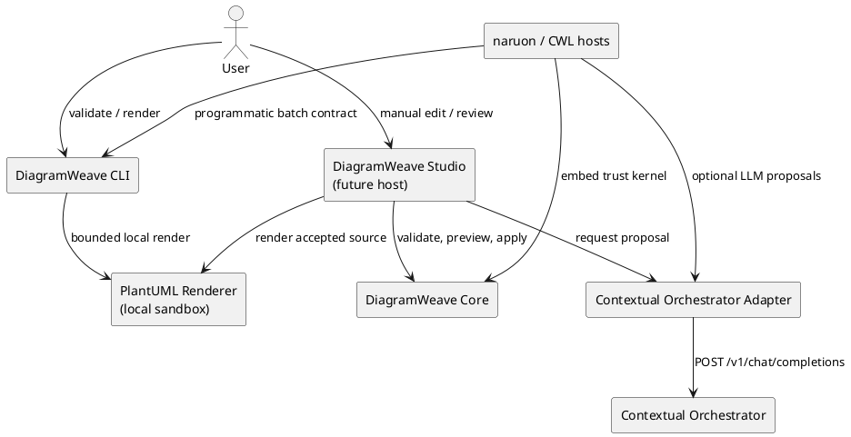

# DiagramWeave Architecture

## Purpose

DiagramWeave is a source-first editor platform for PlantUML and future text diagram languages. The architecture protects manual editing as the authoritative workflow while making LLM output reviewable, revision-bound, and replaceable. The implemented foundation contains a portable trust kernel, a Contextual Orchestrator adapter, an isolated local PlantUML renderer, and a deterministic CLI. It still contains no database, desktop shell, or hidden document store; future surfaces must reuse these boundaries rather than reimplement them.

## Architectural principles

1. **Source files are authoritative.** A host may cache editor state, but saved text remains the system of record.
2. **Manual editing is independent.** DiagramWeave remains useful without an account, network connection, model provider, or Contextual Orchestrator instance.
3. **AI proposes; the host decides.** Model output is an untrusted `EditProposal`, not a direct mutation.
4. **Exact revisions fail closed.** A proposal applies only to the SHA-256 revision from which it was produced.
5. **Scope expansion is visible.** An effective range outside the requested range requires a reason and explicit host approval.
6. **Modules compose without becoming inseparable.** Each package has one purpose and can run inside DiagramWeave Studio, naruon, an IDE extension, a CLI, or another CWL service.
7. **Provider and renderer boundaries are adapters.** Core never imports a network client, renderer process, UI framework, or persistence implementation.

## System context



The diagram is documentation, not a runtime dependency. DiagramWeave Core can be used without Studio, Contextual Orchestrator, or PlantUML.

## Module boundaries

### DiagramWeave Core

Package: `@contextualwisdomlab/diagramweave-core`

Responsibilities:

- calculate deterministic SHA-256 source revisions;
- validate the `EditProposal` contract;
- reject stale revisions;
- validate requested and effective UTF-16 ranges;
- detect scope expansion;
- require explicit approval before previewing or applying expanded edits;
- return immutable normalized values.

Non-responsibilities:

- rendering PlantUML;
- calling an LLM;
- reading or writing files;
- saving history;
- choosing whether a user should accept a proposal;
- parsing a diagram into a full semantic AST.

Public entry points:

```js
import {
  applyEditProposal,
  hashSource,
  previewEditProposal,
  validateEditProposal,
} from '@contextualwisdomlab/diagramweave-core';
```

### Contextual Orchestrator adapter

Package: `@contextualwisdomlab/diagramweave-contextual-orchestrator`

Responsibilities:

- validate the configured endpoint, model, token, timeout, and fetch boundary;
- allow remote HTTPS and loopback-only HTTP;
- bound source and instruction sizes;
- construct the exact two-message model contract;
- send a non-streaming OpenAI-compatible request;
- reject error bodies without reading them;
- distinguish timeout, transport, HTTP, response-shape, and assistant-JSON failures;
- pass parsed output through DiagramWeave Core validation.

Non-responsibilities:

- persisting credentials;
- reading process environment variables;
- logging source, prompts, responses, or tokens;
- applying a proposal;
- rendering or saving the accepted source.

### DiagramWeave Studio

Status: future product surface.

Studio will own file tabs, manual source editing, preview layout, diagnostics, Context Inspector, diff review, keyboard interaction, recovery, and user approval. It must consume Core rather than reimplement revision or scope checks. UI work requires Figma/Product Design state coverage before implementation because source, preview, diff, diagnostics, offline, timeout, conflict, and scope-expansion states interact visibly.

### PlantUML renderer

Package: `@contextualwisdomlab/diagramweave-plantuml-renderer`

Responsibilities:

- require absolute host-supplied Java and PlantUML JAR paths;
- pass source only through stdin with no temporary source file;
- spawn without a shell and with an empty child environment;
- force PlantUML `SANDBOX`, UTF-8, source-metadata suppression, standard reporting, and SVG/PNG pipe mode;
- bound source, stdout, stderr, and wall-clock time;
- validate one complete SVG or PNG stream;
- return an immutable base64 artifact tied to the Core SHA-256 source revision;
- return stable source-free errors.

Non-responsibilities:

- bundling or downloading Java, PlantUML, Graphviz, or fonts;
- enabling local or remote includes;
- persisting source or artifacts;
- parsing diagnostics into editor locations;
- providing a CLI or Studio preview state.

Public entry point:

```js
import {
  createPlantUmlRenderer,
} from '@contextualwisdomlab/diagramweave-plantuml-renderer';
```

The renderer is independently reusable by Studio, CLI, naruon, or another CWL host. A future include-capable renderer must be a separate explicit policy mode; it must not weaken this package's `SANDBOX` contract.

### DiagramWeave CLI

Package: `@contextualwisdomlab/diagramweave-cli`

Responsibilities:

- provide `dweave validate` and `dweave render` for one file or a deterministic recursive batch;
- reuse the sandboxed PlantUML renderer without an LLM or network dependency;
- reject symbolic links, unsafe paths, predictable output collisions, and implicit overwrite;
- return stable human and JSON reports with exit codes `0`, `1`, and `2`;
- expose a process-independent API reusable by naruon, CI, and another CWL host.

Non-responsibilities:

- bundling or discovering Java and PlantUML;
- providing structured source locations for PlantUML diagnostics;
- concurrent folder rendering, formatting, policy packs, Studio state, or persistence;
- exposing source, raw renderer diagnostics, executable paths, or environment values.

### DiagramWeave Language Server

Status: future reusable module.

The language server will provide editor diagnostics and navigation without depending on Studio. It must use the same language and policy adapters as Studio and the CLI.

## Data flow

### Proposal request

1. The host obtains an explicit source string, document identifier, requested range, operation type, and instruction.
2. The adapter validates sizes and range boundaries.
3. The adapter hashes the exact source and serializes the request as untrusted JSON data.
4. Contextual Orchestrator routes or conducts the model work behind its OpenAI-compatible interface.
5. The adapter accepts only one raw JSON object or one complete JSON code fence.
6. Core validates schema, identifiers, operation type, ranges, replacement, summary, assumptions, and source revision.
7. The host receives an immutable proposal. The source remains unchanged.

### Proposal preview and application

1. The host calls `previewEditProposal(source, proposal)`.
2. Core recomputes the current revision and rejects stale proposals.
3. Core rejects an expanded range unless `allowScopeExpansion: true` is explicit.
4. Core returns next source and before/after hashes without mutating input.
5. The host displays source diff and, later, before/after rendered artifacts.
6. Only a user-approved host action calls `applyEditProposal` or writes a file.

## Error model

Core errors have stable `code` fields:

- `invalid_source`
- `invalid_edit_proposal`
- `revision_conflict`
- `scope_expansion_required`

Renderer errors have stable `code` fields:

- `invalid_renderer_options`
- `invalid_render_request`
- `renderer_unavailable`
- `renderer_timeout`
- `renderer_output_too_large`
- `renderer_failed`
- `renderer_output_invalid`

Adapter errors have stable `code` fields:

- `invalid_client_options`
- `invalid_request`
- `provider_timeout`
- `provider_unavailable`
- `provider_http_error`
- `provider_response_invalid`
- `assistant_json_invalid`

Host products branch on `code`, not localized message text. They must not show provider response bodies or bearer tokens in diagnostics.

## Modular MSA compatibility

DiagramWeave uses package boundaries first and service boundaries only where they add isolation or independent scaling. This avoids forcing a distributed deployment onto local and offline users while preserving a **modular MSA** path:

- Core is an embeddable library with no network dependency.
- The Contextual Orchestrator adapter is replaceable and can point to local, organizational, or managed deployments.
- The PlantUML renderer is an isolated local process adapter and can later be wrapped by a versioned service without changing its artifact contract.
- The CLI is an independent batch host that composes the renderer with deterministic path and report contracts for CI and naruon.
- Collaboration, policy, and persistence can become local processes or services behind versioned contracts.
- naruon can invoke Core, the renderer, and the Contextual Orchestrator adapter without embedding Studio.
- organization-central `.github` workflows govern PRs without copying policy logic into production packages.
- each package retains independent tests, version metadata, and public documentation.

## Persistence contract

The foundation introduces no database. If persistence is added, source files remain authoritative and all database objects use descriptive two-word-or-longer `snake_case` names, such as `diagram_document`, `source_revision`, `edit_proposal`, and `render_artifact`. Schema changes require migration, rollback, and compatibility tests.

## Compatibility and versioning

- Node.js 22 and 24 are supported foundation runtimes.
- Packages use ECMAScript modules.
- Public error codes, proposal schema version, and package exports are compatibility contracts.
- A breaking proposal schema requires a new `schemaVersion` and migration guidance.
- Package releases follow Semantic Versioning after an integrated release candidate is ready.
- `CHANGELOG.md` remains the user-facing history of contract changes.
