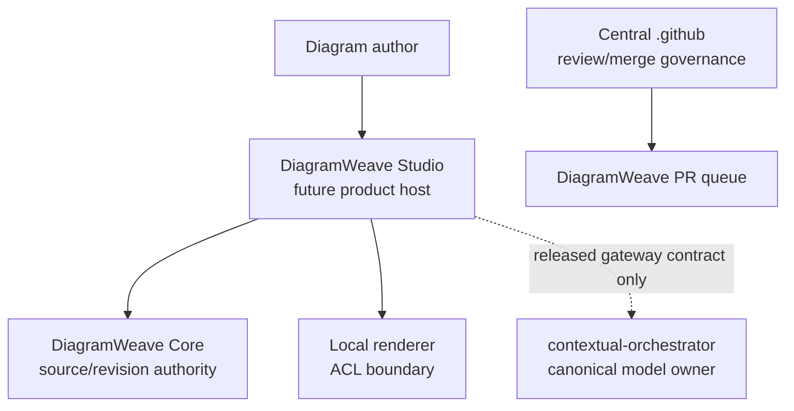
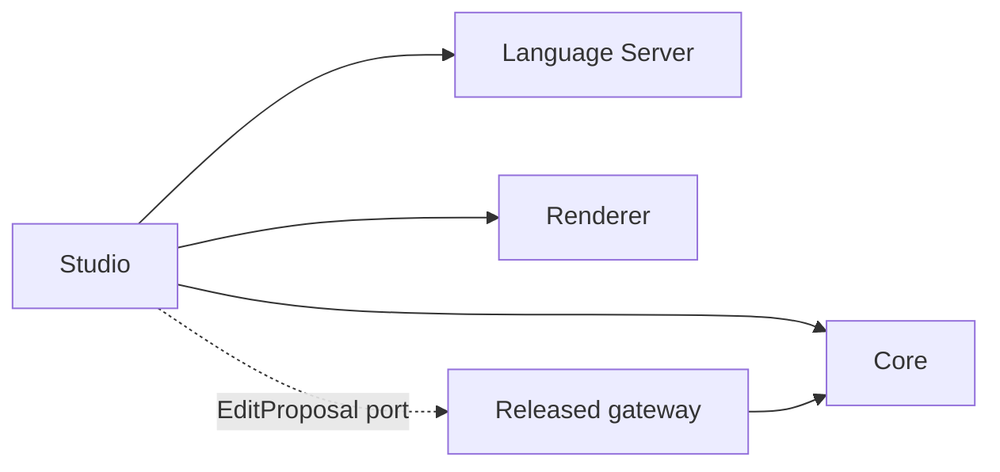

# DiagramWeave Product–Technical Gap Baseline

**Evidence date:** 2026-10-03  
**Protected-main evidence:** `2f95243534778dbab69bf957aeaaeacfa253f6f0`  
**Status:** Living baseline; Proposed deltas do not become protected capability until ordinary merge.

## Goal and evidence boundary

DiagramWeave is a source-first, local-first diagram editing platform whose buyer-visible product is DiagramWeave Studio. The current repository is still pre-release: the GitHub Releases inventory is empty, `package.json` is private at version `0.0.0`, and Studio remains a future surface. This baseline binds claims to protected `main`, exact pull-request heads, immutable owner releases, tests, and published artifacts rather than branch intent.

At this evidence point, PR `#34` is open at exact head `2d3c4ded7efe397d01f2f3c3ec9fb062516f43ba`; its required Checks are green but it has no qualifying independent approval, so it is not merged capability. The automation-boundary repair described by ADR-0008 is Proposed on a separate branch and does not revise protected-main truth until merge.

## PRD and TRD alignment

| Concern | PRD/TRD intent | Current evidence | Gap / Action | Status |
|---|---|---|---|---|
| Source authority | Manual editing remains useful without account, network, or LLM | Core, CLI, renderer, and Language Server contracts exist on protected `main` | Preserve while adding Studio | Implemented foundation |
| Buyer surface | DiagramWeave Studio composes editing, preview, diagnostics, proposal review, and recovery | Studio is documented as a future surface; Issue `#29` tracks the first vertical slice | Build one realistic file-open/edit/validate/render/review flow with accessibility, i18n, Storybook states, and measured performance | Open |
| Model gateway | Optional provider-neutral proposal adapter | Direct-provider automation exists on protected `main`; owner `contextual-orchestrator` has zero GitHub Releases and Issue `#1023` tracks the immutable gateway | Merge ADR-0008 fail-closed repair; later pin the released gateway and request only `orchestrator/free` | Proposed / owner-blocked |
| Publication authority | Proposal generation, verification, publication, review, merge, and release are separate | ADR-0007 states the boundary, while the protected workflow combines model execution and write-capable publication in one job | Complete Issue `#28` with distinct credentials and exact-revision evidence | Open |
| Release evidence | Immutable version, changelog, SBOM, provenance, API/schema and behavior evidence | No DiagramWeave GitHub Release exists | Release only after protected contracts and buyer surface meet acceptance evidence | Open |

## Context Map

- DiagramWeave owns its product Ubiquitous Language, source revision, proposal review, rendering policy, Studio experience, and product truth.
- `contextual-orchestrator` owns provider discovery, capability routing, fallback, and the `orchestrator/free` gateway contract. DiagramWeave is only a future released-contract consumer.
- Central `.github` owns reusable review/merge governance. DiagramWeave pins the reusable workflow instead of copying policy.

## UML component boundary

The dashed dependency is absent until an immutable owner release passes consumer conformance. A test double may implement the `EditProposal` port in tests; production may not import owner source or read an owner database.

## ERD and persistence status

DiagramWeave currently owns no database and therefore has no implemented ERD. Source files remain the system of record. Any future recovery, translation, audit, or collaboration store requires a separate ADR, 3NF schema, minimal transaction aggregates, explicit retention, and a migration/rollback contract; conceptual entities must not be presented as deployed persistence.

## Gap and action register

| ID | Buyer-visible or governance Gap | Exact evidence | Next bounded action | Status |
|---|---|---|---|---|
| DW-AUT-001 | Direct-provider scheduled workflow violates the canonical owner boundary | Protected main `2f95243`; ADR-0008 proposal and RED workflow tests | Merge fail-closed consumer repair after exact-head Checks and review | Proposed |
| DW-CO-001 | No immutable `orchestrator/free` gateway release | `ContextualWisdomLab/contextual-orchestrator` Releases = 0; owner Issue `#1023` | Complete owner RED→GREEN→immutable release, then consumer pin | Owner-blocked |
| DW-STUDIO-001 | No buyer-operable Studio vertical slice | DiagramWeave Issue `#29`; architecture marks Studio future | Build first product slice with normal/loading/empty/error/permission/responsive states and ko/en/ja/zh/vi/es/de/fr layout evidence | Open |
| DW-OPS-001 | Proposal verification and publication authority are not fully separated | DiagramWeave Issue `#28`; ADR-0007 | Introduce independent verification artifact and privileged publisher after released gateway exists | Open |
| DW-WF-001 | Orphaned automation identities remain | DiagramWeave Issue `#27` | Inventory by exact workflow/ref identity and retire only after successor carryover evidence | Open |
| DW-REL-001 | Product has no immutable release | GitHub Releases = 0; private `0.0.0` workspace | Publish only after buyer slice, security, package, SBOM, provenance, and recovery evidence are green | Open |

## Loop

1. Repair every open PR at its exact head and keep valid deltas alive; never use a force push or represent waiting review as success.
2. Merge only through ordinary protected-branch policy after exact-head Checks and qualifying review.
3. When the PR queue is empty, select the highest-leverage Gap whose canonical owner and dependency evidence permit a bounded RED→GREEN increment.
4. Repair internal supplier defects at the canonical owner, publish an immutable release, and only then bump the consumer.
5. Update this baseline from protected ADRs, current releases, exact PR heads, Issues, tests, and runtime evidence after each merge.
